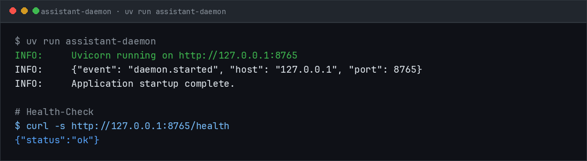
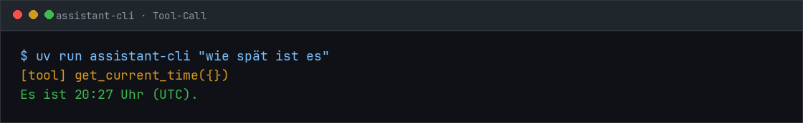
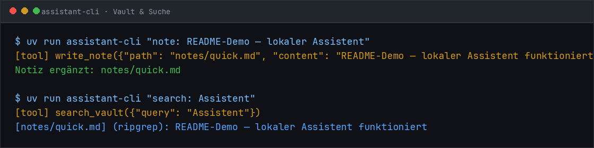
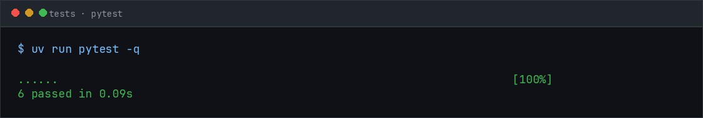

<p align="center">
  
</p>

<h1 align="center">Local Assistant OS</h1>

<p align="center">
  <strong>Dein persönlicher Assistent — lokal, privat, ohne Cloud.</strong><br>
  Sprache, Hotkey oder CLI → lokales Sprachmodell → Obsidian-Vault.
</p>

<p align="center">
  
  
  
  
</p>

---

## Was ist das?

**Local Assistant OS** ist ein dauerhaft laufender Daemon auf deiner Hardware. Er nimmt Anfragen entgegen, routet sie intelligent an lokale Sprachmodelle, führt Werkzeuge aus und speichert Ergebnisse als lesbares Markdown in einem Obsidian-Vault.

Kein Cloud-Roundtrip. Keine laufenden API-Kosten. Alles bindet an `127.0.0.1`.

```
┌─────────────┐  ┌─────────────┐  ┌─────────────┐  ┌─────────────┐
│  HUD        │  │  Voice      │  │  CLI        │  │  Scheduler  │
│  (Tauri)    │  │  (STT/TTS)  │  │  (Debug)    │  │  (Cron)     │
└──────┬──────┘  └──────┬──────┘  └──────┬──────┘  └──────┬──────┘
       │                │                │                │
       └────────────────┴───────WebSocket┴────────────────┘
                                 │
                    ┌────────────▼────────────┐
                    │        DAEMON           │
                    │  Intent-Router · Tools  │
                    └───┬─────────┬────────┬──┘
                        │         │        │
              ┌─────────▼──┐ ┌────▼─────┐ ┌▼──────────────┐
              │  Ollama    │ │  Vault   │ │  Tool-Layer   │
              │  :11434    │ │ Markdown │ │  OCR · Shell  │
              └────────────┘ └──────────┘ └───────────────┘
```

> **Leitprinzip:** Der Daemon ist das Produkt. HUD, Voice und CLI sind austauschbare Clients ohne eigene Logik.

---

## Screenshots

### Daemon & Health-Check

Der Daemon startet auf `127.0.0.1:8765` und meldet sich sofort bereit.

<p align="center">
  
</p>

### CLI mit Tool-Calls

Natürlichsprachige Anfragen werden regelbasiert auf Werkzeuge gemappt — ohne unnötigen LLM-Aufruf.

<p align="center">
  
</p>

### Vault & semantische Suche

Notizen landen im Obsidian-Vault und sind per Hybrid-Retrieval (ripgrep + Embeddings) wiederauffindbar.

<p align="center">
  
</p>

### Tests

<p align="center">
  
</p>

---

## Features

| Bereich | Status | Beschreibung |
|---------|--------|--------------|
| Daemon + WebSocket | ✅ | FastAPI, Streaming-Protokoll, Session-Management |
| Intent-Router | ✅ | Regeln zuerst, dann Router-Modell (`gemma4:e2b`) |
| Tool-Loop | ✅ | Max. 8 Iterationen, 45 s Timeout, Duplikat-Erkennung |
| Obsidian-Vault | ✅ | Lesen, Schreiben, Daily Notes, Frontmatter |
| Hybrid-Suche | ✅ | ripgrep + `sqlite-vec`, Dateisystem-Watcher |
| LLM-Abstraktion | ✅ | Modellwechsel nur in `daemon/config.toml` |
| HUD (Tauri) | 🔜 | Phase 3 — OS-Entscheidung ausstehend |
| Vision / OCR | 🔜 | Phase 4 — plattformnative OCR |
| Voice | 🔜 | Phase 5 — Wake-Word, Whisper, Piper |

---

## Schnellstart

### Voraussetzungen

- **Python 3.12+**
- **[uv](https://docs.astral.sh/uv/)** — Paketmanager
- **[Ollama](https://ollama.com/)** — lokale Modell-Runtime
- **ripgrep** (`rg`) — für Vault-Volltextsuche
- **32 GB RAM / 24 GB VRAM** empfohlen (siehe [PROJECT.md](PROJECT.md))

### Installation

```bash
git clone <dein-privates-repo>
cd local-assistant

chmod +x scripts/setup.sh
./scripts/setup.sh
```

Das Setup-Skript richtet die Python-Umgebung ein und zieht die konfigurierten Ollama-Modelle.

### Starten

```bash
# Terminal 1 — Daemon
uv run assistant-daemon

# Terminal 2 — CLI
uv run assistant-cli "wie spät ist es"
uv run assistant-cli "note: Einkaufsliste — Milch, Brot"
uv run assistant-cli "search: Einkauf"
```

### Healthcheck

```bash
uv run python scripts/healthcheck.py
```

Gibt Latenz für Router- und Workhorse-Modell sowie VRAM-Auslastung aus.

---

## Konfiguration

Alle Laufzeit-Entscheidungen liegen in einer Datei:

```toml
# daemon/config.toml

[models]
router    = "gemma4:e2b"       # ~2 GB, permanent geladen
workhorse = "gemma4:26b"       # ~15–18 GB, 10 min keep_alive
embed     = "nomic-embed-text"

[vault]
path = "~/Vault"

[server]
host = "127.0.0.1"
port = 8765
```

Ein Modellwechsel (z. B. Fallback auf `qwen3.6:27b`) betrifft **ausschließlich** diese Datei — nie den Code.

---

## Projektstruktur

```
local-assistant/
├── daemon/           # Kern: Router, Tool-Loop, Memory, LLM
│   ├── main.py       # FastAPI + WebSocket
│   ├── config.toml   # ← hier konfigurieren
│   ├── llm/          # Ollama-Abstraktion
│   ├── memory/       # Vault, Index, Retrieval
│   └── tools/        # Werkzeugkatalog
├── cli.py            # WebSocket-CLI-Client
├── hud/              # Tauri-Overlay (Phase 3)
├── voice/            # STT/TTS (Phase 5)
├── scripts/          # Setup, Healthcheck, Screenshots
└── docs/screenshots/ # README-Screenshots
```

Vollständige Spezifikation: **[PROJECT.md](PROJECT.md)**

---

## Entwicklung

```bash
# Abhängigkeiten synchronisieren
uv sync --group dev

# Tests
uv run pytest

# README-Screenshots neu generieren (Daemon muss laufen)
uv run python scripts/generate_screenshots.py
```

---

## Roadmap

| Phase | Fokus | Akzeptanzkriterium |
|-------|-------|-------------------|
| **0** Fundament | uv, Ollama, Healthcheck | Latenz für Router + Workhorse |
| **1** Daemon-Kern | WebSocket, Tool-Loop, CLI | `cli.py "wie spät ist es"` via Tool-Call |
| **2** Memory | Vault, Index, Scheduler | Semantische Wiederfindung |
| **3** HUD | Tauri, Tray, Hotkey | Overlay < 150 ms, < 100 MB idle |
| **4** Vision | Native OCR, `look_at` | Aktives Fenster < 200 ms |
| **5** Voice | Wake-Word, STT, TTS | End-to-end < 6 s |
| **6** Härtung | Reconnect, Autostart, A/B-Tests | Produktionsreife |

---

## Privates Repository einrichten

Dieses Projekt ist für den **privaten Gebrauch** gedacht. So legst du ein privates GitHub-Repository an:

```bash
# GitHub CLI installieren & anmelden
gh auth login

# Privates Repo erstellen und pushen
gh repo create local-assistant --private --source=. --remote=origin --push
```

Alternativ manuell auf [github.com/new](https://github.com/new) ein **privates** Repository anlegen, dann:

```bash
git remote add origin git@github.com:<dein-user>/local-assistant.git
git push -u origin cursor/local-assistant-os-3f7d
```

> **Hinweis:** Das Repository enthält absichtlich keine Lizenz. Nutzung und Weitergabe liegen vollständig in deiner Verantwortung.

---

## Offene Entscheidungen

Vor Phase 3 und 4 sollten diese Punkte geklärt werden:

1. **Betriebssystem** — bestimmt OCR-Backend und HUD-Overlay
2. **Vault-Standort** — neuer Vault oder bestehender Obsidian-Ordner?
3. **Wake-Word vs. Hotkey** — Hotkey ist zuverlässiger und günstiger
4. **Cloud-Eskalation** — optional für `complex`-Anfragen (opt-in)
5. **Projektname** — noch offen

---

<p align="center">
  <sub>Lokal gebaut. Für dich. Ohne Cloud.</sub>
</p>
